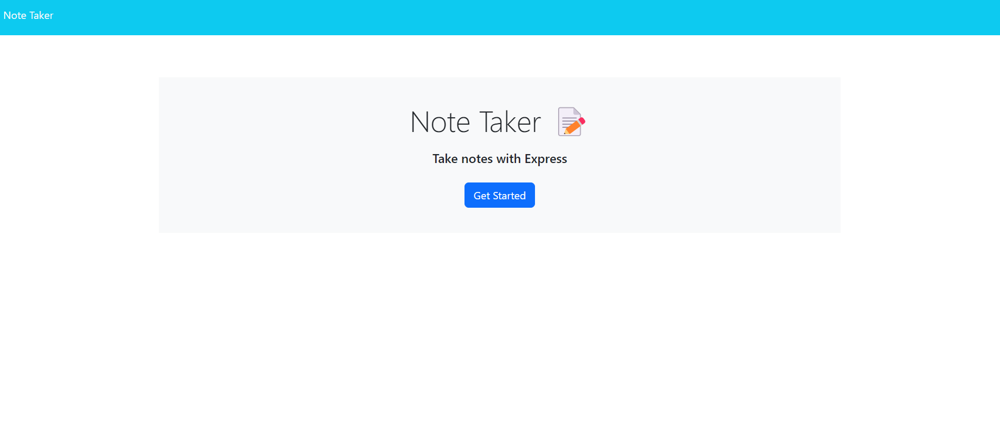
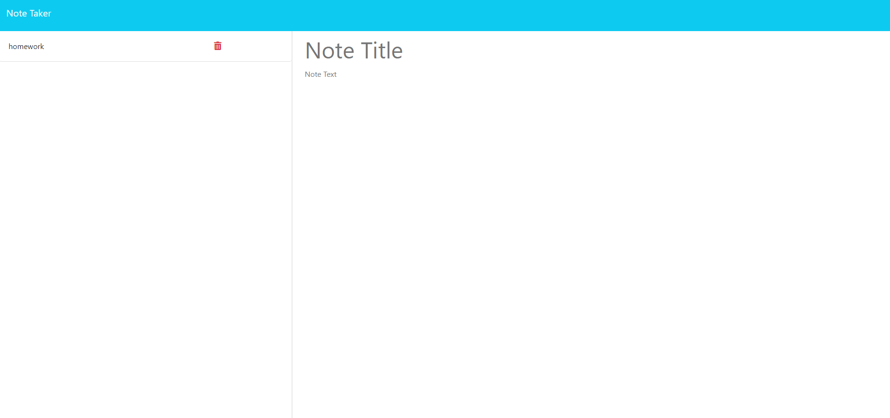

# Fancy Notes

by Ethan Verellen

## Table of Contents

[Description](#description)

[visuals](#visuals)

[Useage](#useage)

[Installation](#installation)

[Tests](#tests)

[Contributors](#contributors)

[Links](#links)

[Questions](#questions)

## Description

It is a way to write down notes on a database

## Visuals

## Useage

Go into a terminal/git bash, find your way to the folder and type in the line 'npm i', then 'node server.js'. Awnser the prompts that apear there and it will tell you that it is done.  Remember to remove the temp- from infront of the new file made.

## Installation

To install, Either download as a zip file from the repo, or git clone in gitbash or other equivelences.

## Tests

In order to test it, you must launch it and work through it.

## Contributing

Ethan Verellen

## Links

https://github.com/Ethan-Verellen/Fancy-Notes

## Questions

https://github.com/Ethan-Verellen

ethanverellen@gmail.com

